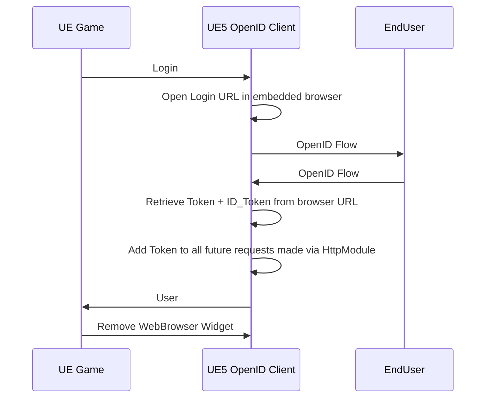

The embedded browser flow is using the web browser plugin developed by Epic Games. This plugin allows the creation of a web browser inside your game. Therefore, it is possible to use this to perform the OpenID or OAuth2 flows. This is less secure than using the external browser method.

To use this flow, simply call the login method as in the following example. Keep in mind to replace the Clinet ID with the proper value. For more information refer to [providers](../providers/providers). You also need to create an web browser widget containing only an OAuth++ Web Browser.

<iframe src="https://blueprintue.com/render/9_hqms1p/" scrolling="no" allowfullscreen width="100%" height=600></iframe>