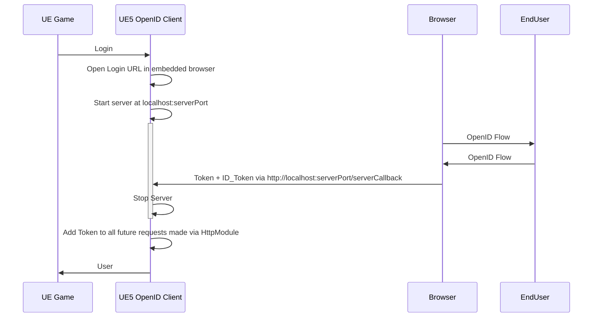

This flow, recommended by the plugin, utilizes the system's default browser to run the OpenID or OAuth2 flow. This approach allows your game to trigger the opening of the browser as a separate application, where the user can complete the necessary steps. Once complete, the browser will send back the required information to the game. This flow provides a seamless user experience and ensures the security of the user's information.

To use this flow, simply call the login method as in the following example. Keep in mind to replace the Clinet ID with the proper value. For more information refer to [providers](../providers/providers). The `Get subsystem` node refers to `OAuth++ Subsystem`.

<iframe src="https://blueprintue.com/render/qpb2w1fk/" scrolling="no" allowfullscreen width="100%" height=600></iframe>
