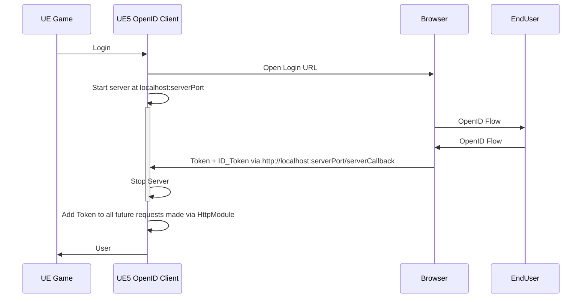

This document serves as documentation for the UE5 OpenID Client Plugin.

Check out the CHANGELOG to see what’s new!

{: .warning }
This is a code plugin which requires good knowledge of the OpenID protocol. The current version 0.4 does NOT support Facebook login as they don’t support the form_post response mode. Facebook support will be added in future versions.

## Version 0.4
Version 0.4 comes with some big changes! The plugin finally supports a proper browser login flow. The new flow, redirects the user to a new tab in the platform’s default browser, where the user performs all the steps necessary for authentication and authorization. Afterwards, the browser returns the recieved credentials (token, id_token) to the game instance.

To achieve this, the following workflow is being used:

## Example project
  [OpenID Complex Browser Example](https://github.com/taigi100/OpenID_Complex_Browser_Example)  - Shows how to log into google and call the APIs afterwards, using [VARest](https://www.unrealengine.com/marketplace/en-US/product/varest-plugin).

## Notes
You can manualy clear the webcache by deleting the saved\webcache folder within the project.